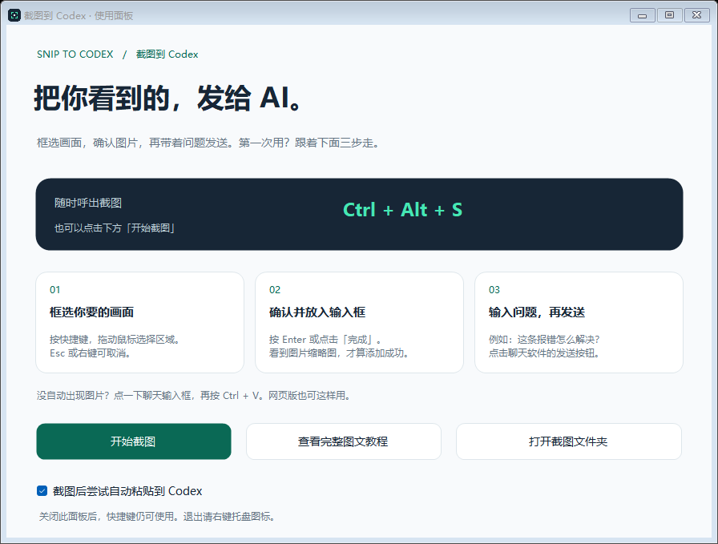
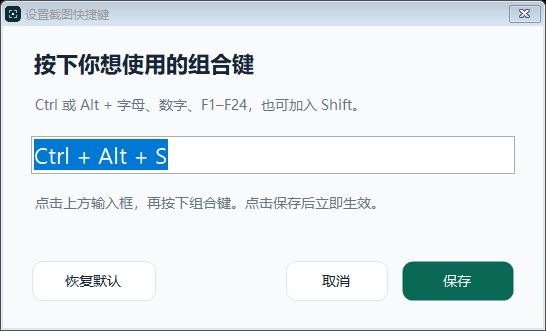
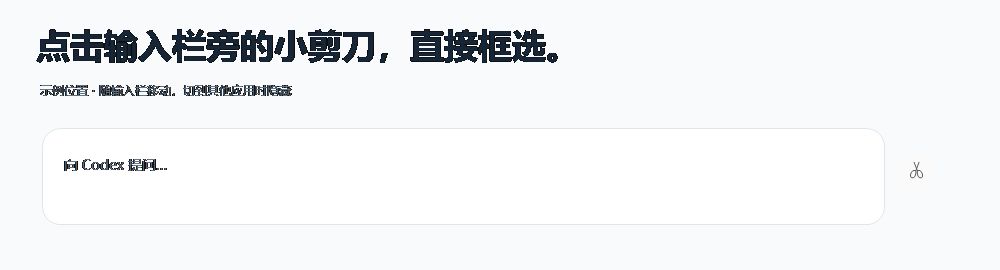
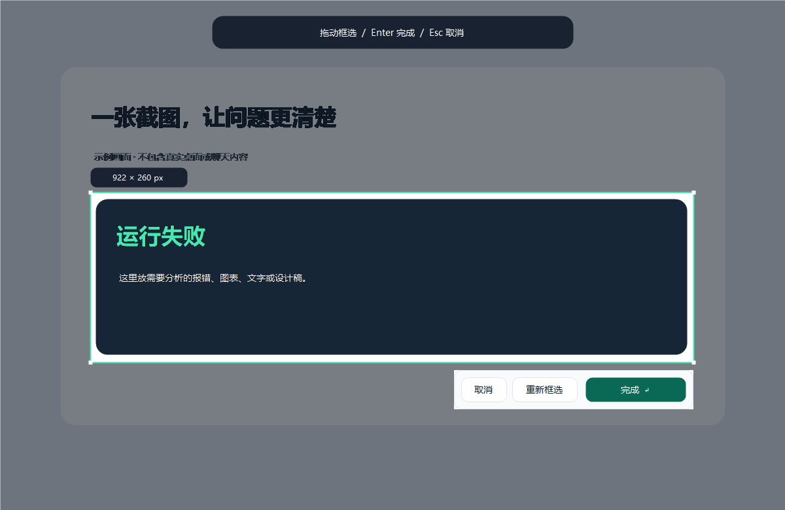

# 截图到 Codex · Snip to Codex

**按你设置的快捷键，或点击输入栏旁的小剪刀，把截图放进 AI 聊天。**

[下载 Windows 安装包](https://github.com/lc15606626569-collab/snip-to-codex/releases/latest) · [新手图文教程](https://github.com/lc15606626569-collab/snip-to-codex/blob/main/plugins/snip-to-codex/docs/%E4%BD%BF%E7%94%A8%E6%95%99%E7%A8%8B.md)

Windows 截图助手，附带首次使用引导、离线图文教程和可选 Codex 插件。适合把报错、图表、文字或设计稿发给 AI。无需 Python、Node.js 或 API 密钥。



## 普通用户：三分钟开始使用

1. 打开本项目的 **Releases（发行版）**，进入最新版本。
2. 在 **Assets** 下载 **SnipToCodex-v1.2.1-windows-x64.zip**，不要选择给开发者用的 Source code。
3. 右键 ZIP → **全部解压缩**。进入解压后的文件夹，双击 **Install.cmd**。
4. 打开桌面的 **Snip to Codex**。先看软件里的三步引导，也可点击 **查看完整图文教程**。
5. 打开想发送图片的 Codex / ChatGPT 对话，再显示要截图的画面。
6. 按 **Ctrl + Alt + S** → 拖动框选 → 按 **Enter** 确认。
7. 检查聊天输入框中的图片缩略图，输入问题，再点击聊天软件的 **发送**。

**没自动出现图片？** 点击目标输入框，按 **Ctrl + V**。网页版使用这个手动方式。

**免安装使用：** 完整解压后双击 `Start.cmd`。请保留完整文件夹，不要只复制 exe。

**完整教学：** [一步一步的中文教程](plugins/snip-to-codex/docs/使用教程.md)；下载后也可直接打开 `docs/guide.html`，支持离线阅读和打印。

## 自己设置快捷键

1. 打开使用面板，点击 **更改快捷键**；托盘右键菜单也有这个入口。
2. 点击录入框，按下新组合，例如 **Ctrl + Shift + S**。
3. 点击 **保存**。新设置立即生效，下次启动仍会保留。

支持 Ctrl 或 Alt 搭配字母、数字、F1–F24，可额外加入 Shift。保存时会检查占用；冲突或保存失败时，原快捷键继续有效。**恢复默认** 会填入 Ctrl+Alt+S，点击保存后应用。



## 点击输入栏旁的小剪刀

工具启动后，切回受支持的 Codex / ChatGPT 桌面版对话，输入栏旁会出现 **小剪刀**。点击它即可框选截图。

- 剪刀会跟随输入栏的位置；切到其他应用、最小化窗口或开始截图时隐藏。
- 小剪刀是独立的悬浮按钮，默认显示，可在使用面板取消勾选 **在对话输入栏旁显示小剪刀**。
- 只在能够识别当前桌面版输入栏时显示，网页版不显示。没有出现时仍可用快捷键或面板按钮截图。
- 定位只使用前台窗口和输入栏的位置，不读取输入文字，也不在后台连续截图。



## 截图时怎么操作



| 操作 | 方法 |
| --- | --- |
| 开始截图 | Ctrl+Alt+S，或使用面板的“开始截图” |
| 确认选区 | Enter，或“完成” |
| 框错了 | “重新框选”，或重新拖动 |
| 取消 | Esc 或鼠标右键 |
| 手动粘贴 | 点击聊天输入框 → Ctrl+V |
| 找回截图 | 托盘右键 → 打开截图文件夹 |
| 再看教程 | 托盘菜单 → 查看图文教程 |
| 退出工具 | 托盘右键 → 退出 |

启动时保存的组合若被占用，会尝试默认组合与备用 **Ctrl+Alt+F8**；实际快捷键以软件面板为准，也可重新设置。关闭面板后仍可通过快捷键截图。默认不开机自启。

## 能在哪些电脑上用

- **发布包：Windows 10 / 11 x64**，使用系统提供的 .NET Framework。建议屏幕分辨率至少 1024×768。
- **桌面版 Codex / ChatGPT：** 尝试识别当前可访问的聊天输入框并粘贴。界面升级或多个窗口可能影响识别，可手动 Ctrl+V。
- **网页版和其他支持图片粘贴的聊天软件：** 截图后手动 Ctrl+V，不会自动定位浏览器标签页。
- **macOS / Linux：** 当前不支持。Windows ARM、混合缩放多显示器尚未完成兼容性验证。
- 工具本身不需要账户；使用 AI 需要你自己的账户及图片输入功能。

安装到 `%LOCALAPPDATA%\Programs\SnipToCodex`，截图保存在 `%LOCALAPPDATA%\SnipToCodex\Captures`。路径按每台电脑当前用户自动计算，没有作者电脑的固定路径。

## 第一次运行的常见问题

**Windows 显示“未知发布者”：** 目前发布包未使用商业代码签名。请从项目 Releases 下载并核对同版本 `SHA256SUMS.txt`，不要关闭系统安全防护。也可审阅并自行编译源码。

**快捷键没有反应：** 确认工具已启动；面板显示实际组合，也可点击“开始截图”。退出占用快捷键的软件后，重启本工具即可重新注册。

**有截图但没有附件：** 点击正确的输入框按 Ctrl+V；仍不行时从截图文件夹找到最新 PNG，再用聊天的附件按钮添加。建议两个程序都以普通用户权限运行。缩略图出现才算添加成功，工具不会替你按发送。

**更新 / 卸载：** 更新时退出旧版，完整解压新版并运行 `Install.cmd`。卸载时运行安装目录下的 `Uninstall.cmd`，再手动删除程序文件夹。截图会保留。若单独安装了 Codex 插件，请在插件页另行卸载；手动添加的开机启动项也需自行移除。

## 可选：安装 Codex 插件

**只是截图、粘贴、发送的用户可以跳过。** 桌面助手无需插件即可使用。

若已安装支持插件的 Codex CLI，可在终端直接执行：

```powershell
codex plugin marketplace add https://github.com/lc15606626569-collab/snip-to-codex.git
codex plugin add snip-to-codex@snip-to-codex-community
```

新建一条 Codex 任务，然后试着说：

- “帮我框选截图并分析。”——屏幕出现选区，亲手框选并确认，Codex 再读取这张图。
- “读取我最近一次截取的图片。”——读取本工具最近保存的 PNG，并说明截图时间。

市场配置在仓库的 `.agents/plugins/marketplace.json`；源码位于 `plugins/snip-to-codex`。插件的交互截图命令在缺少 exe 时会用系统自带编译器构建，从 GitHub 安装不依赖发布包二进制。

## 隐私与边界

只在你触发时截图；确认后保存选区并复制，取消不保存。截图程序没有网络上传、遥测或后台录屏。自动粘贴把图片交给目标聊天软件，后续处理遵循该软件自身的行为。要求 Codex 插件读取图片会把该图片提供给相应任务。

图片不会自动清理；`status.txt` 只记录最近一次动作、路径或错误。提交日志前请检查个人路径。教学截图使用模拟画面。

社区辅助工具，与 OpenAI 官方无隶属关系；不会往原生输入栏注入按钮。

## 开发者

在仓库根目录用 Windows PowerShell 编译：

```powershell
powershell -NoProfile -File plugins/snip-to-codex/scripts/build.ps1
```

使用系统内置 .NET Framework 编译器和 Windows Forms，无第三方运行依赖。GitHub Actions 构建并打包；验证范围见仓库的 `TESTING.md`。

MIT License。欢迎提交带复现步骤的 Issues 和 Pull Requests。
